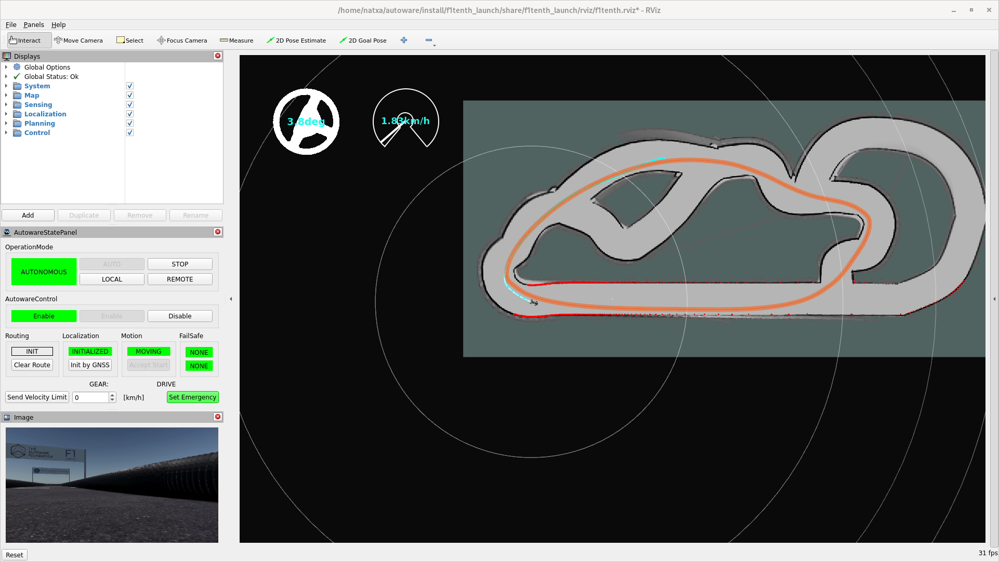
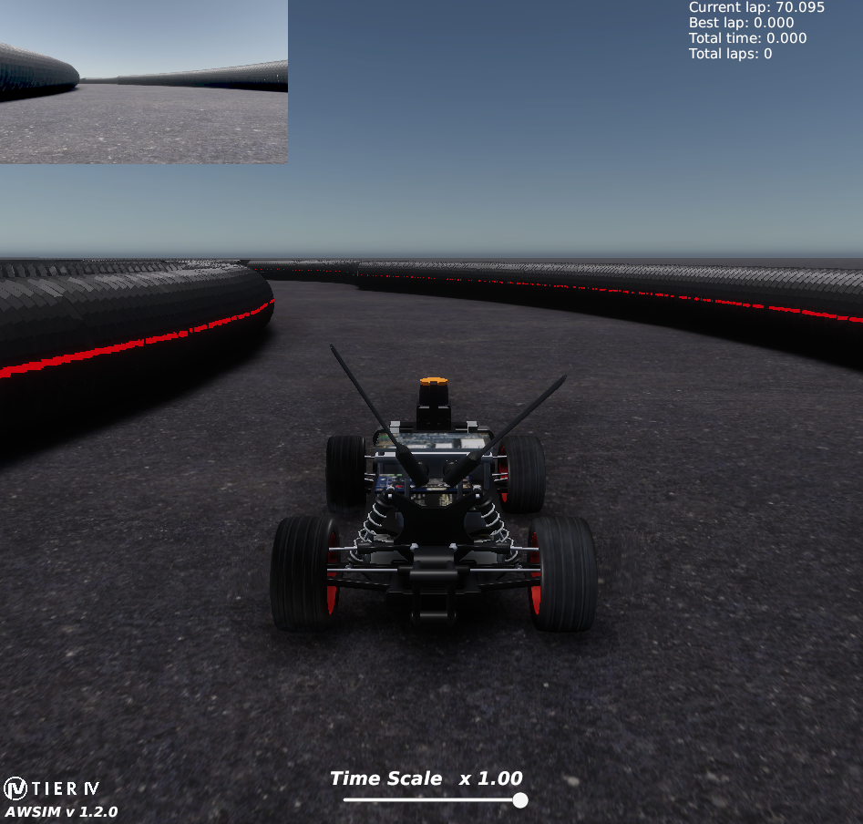
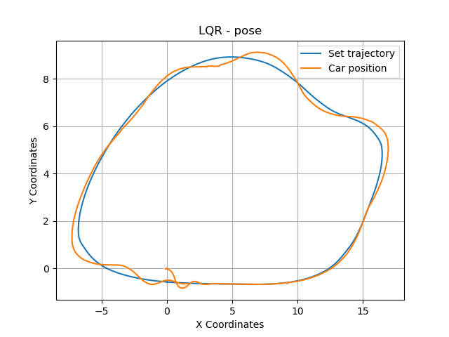
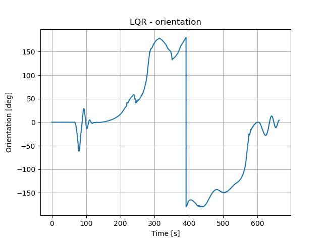
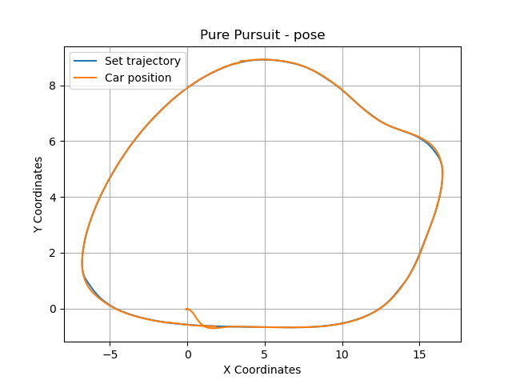

# LQR lateral controller

Linear Quadratic Regulator (LQR) Lateral Controller implementation for Autoware AWSIM - f1tenth. This package provides a robust and efficient method to control the lateral dynamics of autonomous vehicles within the Autoware ecosystem using LQR. This LQR controller is designed to ensure trajectory following for autonomous driving applications.

The controller works by minimizing the lateral deviation and heading error of the vehicle from a given trajectory, providing precise steering commands to maintain the desired path.

## Installation
### Build
```bash
colcon build --symlink-install --cmake-args -DCMAKE_BUILD_TYPE=Release \
-DCMAKE_EXPORT_COMPILE_COMMANDS=On --packages-up-to f1tenth_launch
```
### Params
To ensure having that the vehicle speed is constant change `src/universe/external/trajectory_loader/src/trajectory_loader_node.cpp` line 80:
```
From: trajectory_point.longitudinal_velocity_mps = point[3];
To: trajectory_point.longitudinal_velocity_mps = 0.5;
```
### Additional repositories
- [AgniechaP/autoware.universe](https://github.com/AgniechaP/autoware.universe/tree/feat/add_lqr_controller)
- [AgniechaP/autoware](https://github.com/AgniechaP/autoware/tree/lqr-lateral-controller)
- [AgniechaP/f1tenth_launch](https://github.com/AgniechaP/f1tenth_launch/tree/assignment)
## LQR implementation

[Controller implementation repository.](https://github.com/mgmike1011/lqr_lateral_controller)

### Input

The class that handles controller operation inherits from the base class `LateralControllerBase` and implements the class's virtual methods, which provide data needed for the control algorithm through input arguments (e.g. method `LateralOutput run(InputData const & input_data)`).

### Files

- `lqr.cpp/.hpp` - controller logic implementation,
- `lqr_lateral_controller.cpp/.hpp` - autoware interface for running algorithm, input/output data handling,
- `lqr_lateral_controller_node.cpp/.hpp` - not used, the controller is launched from the base class, left for compatibility and unification of the appearance of packages,
- `lqr_lateral_controller.launch.py` - not used, the controller is launched from the base class, left for compatibility and unification of the appearance of packages.

### Output

The calculated control signal is returned as the output of the function `LateralOutput run(InputData const & input_data)`.

### Assumptions and sources

The presented implementation of the LQR control algorithm was created based on the control method presented in the book [Vehicle Dynamics and Control](https://link.springer.com/book/10.1007/978-1-4614-1433-9). This implementation assumes that the vehicle speed is constant and does not change.

## Usage

Starting the algorithm requires setting the appropriate controller in the launch files of the autoware control system.
Example launch from [https://github.com/amadeuszsz/autoware.git](https://github.com/amadeuszsz/autoware.git):

```bash
source ~/autoware/intall/setup.bash
ros2 launch f1tenth_launch e2e_simulator.launch.py
```

## Performance

### Sample lap

<p align="center">
<video src="media/lqr_lateral_controller.mp4" type="video/mp4" width="500" controls>
    Your browser does not support the video tag.
</video>
</p>
<p align="center">
  
</p>
<p align="center">
  
</p>

### On track
<p align="center">
  
</p> 
<p align="center">
  
</p> 

### Comparison to other base controllers
In order to evaluate the obtained results, the operation of the algorithm was compared with others implemented in the repository. The results are summarized in a table:

| Algorithm | Time per lap [s]|
| --------- | ------------ |
| lqr_lateral_controller | 113.558 |
| pure_pursuit | 108.289 |
| mpc | 112.148 |

<p align="center">
  
</p> 

## Externals

- [Vehicle Dynamics and Control](https://link.springer.com/book/10.1007/978-1-4614-1433-9)
- [Lane-Keeping Control of Autonomous Vehicles Through a Soft-Constrained Iterative LQR](https://arxiv.org/abs/2311.16900)
- [Improved Linear Quadratic Regulator Lateral Path Tracking Approach Based on a Real-Time Updated Algorithm with Fuzzy Control and Cosine Similarity for Autonomous Vehicles](https://www.mdpi.com/2079-9292/11/22/3703)
- [Linear quadratic regulator: Discrete-time finite horizon](https://stanford.edu/class/ee363/lectures/dlqr.pdf)
- [Lateral Control Using Parameter Self-Tuning LQR on Autonomous Vehicle](https://ieeexplore.ieee.org/document/9051390)
- [LQR Control of an All-Wheel Drive Vehicle Considering Variable Input Constraint](https://ieeexplore.ieee.org/document/9354110)

## Credits

Agnieszka Piórkowska\
Natalia Wiśniewska\
Miłosz Gajewski\
**Poznan University of Technology 2024**
